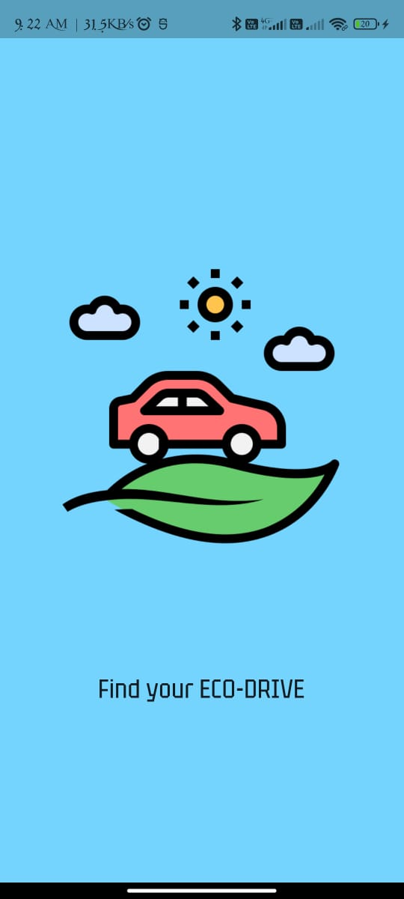
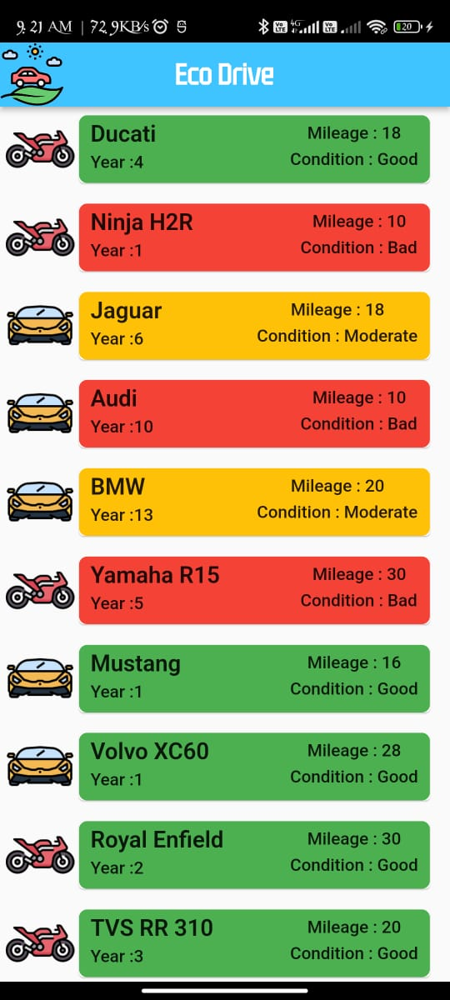

# Eco Drive

**Exercise**: 

 Develop a Flutter app to display a list of vehicles. Any vehicle that gives 15km/litre or above and 5 year old or less is considered to be fuel efficient and low pollutant. This vehicle will have a green color coding. 15km/litre or above but older than 5 year will be fuel efficient, but moderately pollutant. These vehicles will have amber color coding. Everything else will be red colored.

Please use the database and the backend of your choice. Please complete this exercise by the 4th of August. 

**Splash Screen** 

  

**Home Screen**

